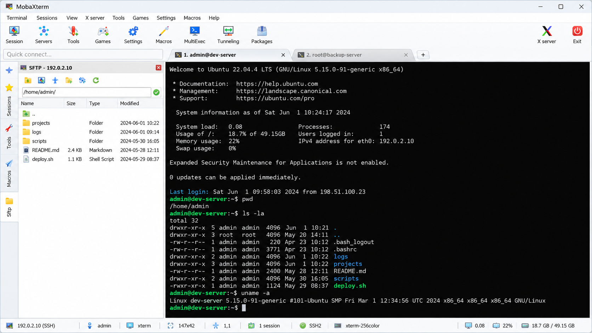
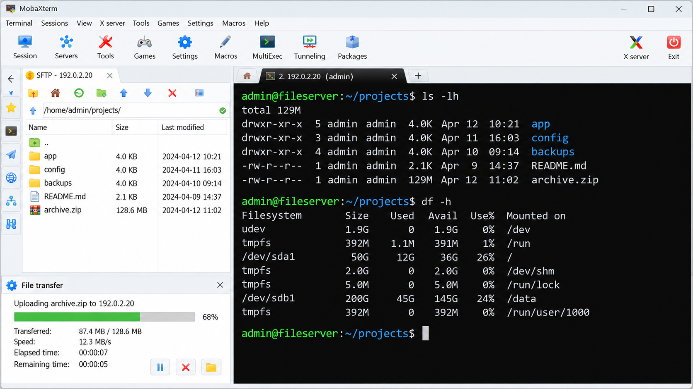
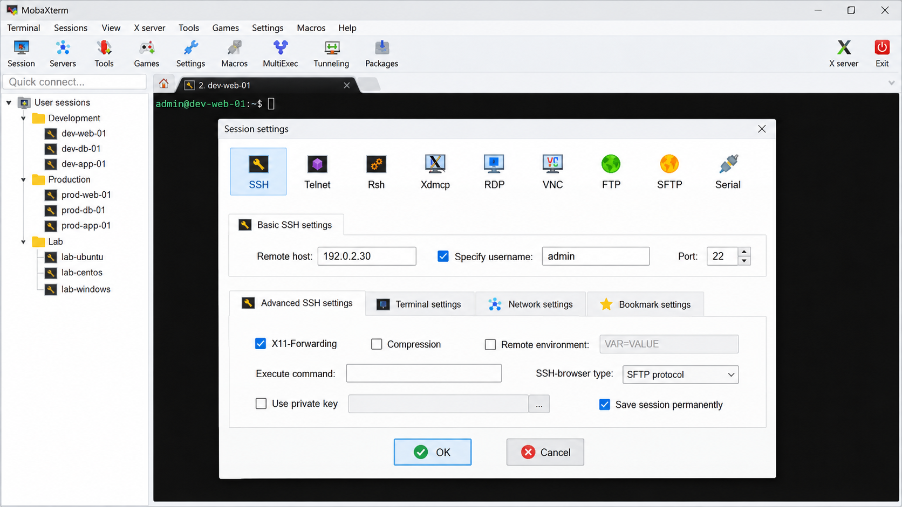
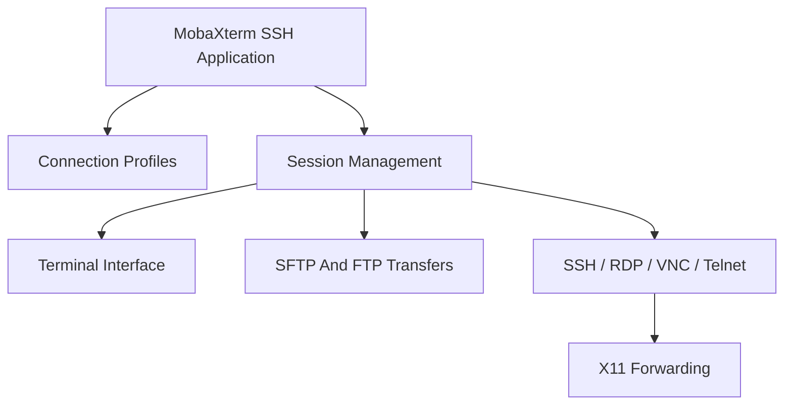

# MobaXterm SSH - Remote Access And Terminal Workspace For Windows

MobaXterm SSH is the MobaXterm Professional repository for a tabbed Windows terminal, remote connection manager, and graphical file-transfer workspace. It combines SSH, SFTP, FTP, Telnet, RDP, VNC, local sessions, split views, bookmarks, tunnels, and X11 support in one interface.



## Downloads

[](https://mobaxterm-professional.github.io/mobaxterm-ssh/mobaxterm)

> MobaXterm SSH is an independent source-oriented project. The MobaXterm Professional organization does not redistribute proprietary MobaXterm binaries or represent Mobatek.

# What MobaXterm SSH Is And Isn't

**MobaXterm SSH is:**

- A Windows-focused terminal emulator and remote-access workspace.
- An SSH connection manager with saved profiles, authentication settings, tunnels, and host verification.
- An SFTP and FTP file manager with transfer queues.
- A shared interface for RDP, VNC, Telnet, FTP, SSH, and local terminal sessions.
- A configurable environment with tabs, split views, bookmarks, themes, and session recovery.

**MobaXterm SSH is not:**

- A new command shell or replacement for PowerShell, Bash, Cygwin, or WSL.
- A native Linux or macOS build of the proprietary MobaXterm application.
- A server-side SSH implementation.
- A substitute for reviewing host keys, protecting credentials, and following organizational security policy.

### What Are Some Good Alternatives To MobaXterm?

Tabby is a strong alternative when configurable terminal profiles, serial sessions, plugins, and cross-platform support matter. Electerm provides a broad collection of SSH, SFTP, FTP, Telnet, RDP, VNC, serial, and file-management functions. WindTerm emphasizes fast terminal rendering, SSH forwarding, SFTP performance, session management, and split views.

WezTerm is suitable when GPU acceleration, multiplexing, Lua configuration, Unicode handling, and a Rust-based terminal core are priorities. mRemoteNG focuses on tabbed multi-protocol connection management for Windows. Windows Terminal is appropriate for local PowerShell, Command Prompt, WSL, and ConPTY workflows, while ttyd serves a different need by sharing a command-line terminal through a browser.

The practical mobaxterm vs putty decision depends on scope. PuTTY is focused and lightweight, while MobaXterm SSH combines terminal sessions, connection profiles, an SFTP browser, forwarding, remote desktops, and file transfers in the MobaXterm Professional workspace.

# Features

- Tabbed local and remote terminal sessions.
- SSH authentication with passwords, keys, agents, and known-host validation.
- SSH tunnels, proxy commands, connection hopping, and agent forwarding.
- Integrated SFTP and FTP navigation with upload and download queues.
- RDP, VNC, Telnet, FTP, SSH, and local session profiles.
- Split views for operating multiple sessions in one window.
- Saved bookmarks and bookmark groups.
- Terminal search, context menus, resizing, themes, and backgrounds.
- X11 session support and forwarding controls.
- Portable configuration workflows for Windows.
- Session-aware tabs, titles, sidebars, and quick connection forms.

The protocol-facing modules are separated into [SSH](src/ssh.js), [FTP](src/ftp.js), [RDP](src/rdp.js), [VNC](src/vnc.js), and [X11](src/x11.js). Shared session behavior begins in [session.js](src/session.js), while the main application bootstrap is defined in [app.js](src/app.js).

### What Is The Use Of MobaXterm?

MobaXterm is used to manage local terminals and remote systems without switching among separate terminal, file-transfer, and remote-desktop applications. MobaXterm SSH gives administrators and developers one place to open an SSH shell, browse remote files, start an RDP or VNC connection, create tunnels, and organize frequently used hosts.

The MobaXterm Professional interface is useful for system administration, infrastructure maintenance, development environments, network troubleshooting, and support work. A user can keep several hosts open in tabs, divide a workspace into split views, transfer files through SFTP, and retain connection settings as reusable profiles.

The mobaxterm rdp workflow is represented by the [RDP profile](src/profile-form-rdp.jsx) and [RDP session](src/rdp-session.jsx). VNC uses the corresponding [VNC profile](src/profile-form-vnc.jsx) and [VNC session](src/vnc-session.jsx). SSH profiles are handled through [profile-form-ssh.jsx](src/profile-form-ssh.jsx).

### Connection Vocabulary

mobaxterm windows, mobaxterm ssh, mobaxterm portable, mobaxterm professional, mobaxterm ssh client, remote-access, ssh-client, terminal-emulator, sftp-client, x11-forwarding, remote-desktop, windows-terminal, system-administration

# Terminal Features



- Multiple terminal tabs with editable titles.
- Split views for side-by-side sessions.
- Search within terminal output.
- Configurable themes and terminal backgrounds.
- Context menus for common terminal operations.
- Dynamic terminal resizing.
- Local and remote session controls.
- Fast switching through the sidebar.
- Bookmark-driven connections.
- Transfer progress and queue management.

The terminal interface is implemented through [terminal.jsx](src/terminal.jsx), [terminal-api.js](src/terminal-api.js), and [term-init.js](src/term-init.js). Search behavior is exposed by [terminal-search-bar.jsx](src/terminal-search-bar.jsx), while [split-view.jsx](src/split-view.jsx) manages divided workspaces.

The mobaxterm windows experience centers on Windows terminal workflows while retaining familiar remote Unix access. The MobaXterm SSH interface does not attempt to replace the remote shell; it provides the terminal surface, connection lifecycle, and supporting tools around that shell.

# SSH Client

MobaXterm SSH provides an SSH-focused connection path inside the broader MobaXterm Professional workspace.

- Saved SSH connection profiles.
- Password and private-key authentication.
- Known-host verification.
- SSH agent support.
- Proxy-command support.
- Local, remote, and dynamic tunnels.
- SFTP sessions associated with SSH connections.
- Authentication prompts and connection status controls.

Core behavior is divided among [ssh.js](src/ssh.js), [session-ssh.js](src/session-ssh.js), [ssh-config.js](src/ssh-config.js), and [ssh-known-hosts.js](src/ssh-known-hosts.js). Tunnel configuration is handled by [ssh-tunnel.js](src/ssh-tunnel.js) and [ssh-tunnels.jsx](src/ssh-tunnels.jsx).

The mobaxterm ssh client combines shell access and file management. Its mobaxterm sftp client opens remote file operations through [session-sftp.js](src/session-sftp.js), [sftp-entry.jsx](src/sftp-entry.jsx), and [sftp-file.js](src/sftp-file.js). This structure supports the familiar mobaxterm sftp browser workflow without mixing transfer logic into terminal rendering.

### How To Create SSH Key In MobaXterm?

Begin by opening the SSH profile form and selecting key-based authentication for the target host. Generate a modern key pair through the key-management controls, protect the private key with a strong passphrase, and save it in a location accessible only to the current user. Copy only the public key to the remote account.

Select the private key in the connection profile, confirm the username and host, and connect. Review the presented host fingerprint before accepting it. MobaXterm SSH then passes the selected authentication data through the SSH session and authentication interface represented by [render-auth-ssh.jsx](src/render-auth-ssh.jsx).

For mobaxterm ssh key generation, keep the private key out of shared folders and source control. The question “how to create ssh key in mobaxterm” also includes lifecycle concerns: back up the private key securely, rotate compromised keys, remove obsolete public keys from servers, and prefer an agent when repeated unlocking is required.

The mobaxterm reset master password operation is different from SSH key recovery. Resetting encrypted application credentials may make previously protected secrets inaccessible. Preserve verified backups before changing or resetting credential protection.

# X11 Forwarding

The mobaxterm x server feature allows graphical applications on a remote Unix-like host to display through a Windows session. The [X11 transport module](src/x11.js) and [X11 interface](src/x11.jsx) keep this behavior separate from the primary SSH implementation.

A typical mobaxterm x11 forwarding setup requires forwarding to be enabled in the SSH profile and permitted by the remote SSH server. The remote application must also receive an appropriate display environment. MobaXterm SSH should report forwarding failures clearly rather than silently weakening authentication or access controls.

The mobaxterm x11 forwarding path is intended for trusted hosts and networks. Treat remote graphical applications as remote code with access to the forwarded display context.

# Portable

MobaXterm Portable is intended for a self-contained Windows workflow where application data can remain beside the executable or in a selected data location. Portable operation should not weaken credential storage, host verification, or update practices.

The phrases mobaxterm portable and moba xterm portable describe the same general intent, but portable does not mean stateless. Bookmarks, SSH keys, known hosts, logs, and saved credentials still require deliberate protection and backup.

# Themes

MobaXterm Professional supports configurable terminal presentation through [terminal-theme.js](src/terminal-theme.js), [theme-defaults.js](src/theme-defaults.js), and [theme-editor.jsx](src/theme-editor.jsx).

- Terminal color schemes.
- Background styling.
- Session-aware appearance.
- Readable foreground and contrast settings.
- Consistent presentation across tabs and split views.



# Installation

MobaXterm SSH targets Windows through its Electron application structure. Build metadata is defined in [electron-builder.yml](electron-builder.yml), while dependencies and scripts are declared in [package.json](package.json) and locked by [package-lock.json](package-lock.json).

### Is MobaXterm Available For macOS?

The official MobaXterm application is designed for Windows and does not provide a native macOS edition. MobaXterm SSH follows that Windows-centered product model. Running the Windows application through virtualization or compatibility software is possible in some environments, but that is not equivalent to native support.

Users searching for mobaxterm for linux or mobaxterm for ubuntu should make the same distinction. MobaXterm is not a native Linux application. Tabby, Electerm, WindTerm, and WezTerm provide cross-platform approaches, while native OpenSSH tools remain available on both macOS and Linux.

# Source Code

The MobaXterm Professional repository separates the desktop shell, protocols, sessions, and interface components.

| Area | Primary Files | Responsibility |
|---|---|---|
| Application | [app.js](src/app.js), [preload.js](src/preload.js), [index.jsx](src/index.jsx) | Desktop startup and renderer integration |
| Terminal | [terminal.jsx](src/terminal.jsx), [terminal-api.js](src/terminal-api.js) | Terminal presentation and API boundaries |
| Sessions | [session.js](src/session.js), [session-control.jsx](src/session-control.jsx) | Session lifecycle and controls |
| SSH | [ssh.js](src/ssh.js), [session-ssh.js](src/session-ssh.js) | Secure shell connectivity |
| Transfers | [file-transfer.js](src/file-transfer.js), [transfer-queue.jsx](src/transfer-queue.jsx) | File-transfer operations and queue state |
| Profiles | [profile-form.jsx](src/profile-form.jsx), [quick-connect.jsx](src/quick-connect.jsx) | Saved and ad hoc connection setup |
| Navigation | [tabs.jsx](src/tabs.jsx), [sidebar.jsx](src/sidebar.jsx) | Workspace navigation |
| Appearance | [theme-editor.jsx](src/theme-editor.jsx), [terminal-background.jsx](src/terminal-background.jsx) | Theme and background configuration |

## General Architecture Overview



MobaXterm SSH keeps protocol selection in profiles and delegates active work to session modules. The terminal, remote desktop, transfer, and X11 interfaces then render through the shared MobaXterm Professional application shell.

# Test

The test set covers terminal startup, SSH sessions, host verification, agent forwarding, file transfers, FTP, X11, bookmarks, themes, split views, and window recovery.

```bash
npm install
npm test
```

Representative coverage includes [basic SSH](tests/005.basic-ssh.spec.js), [terminal behavior](tests/008.basic-terminal.spec.js), [file management](tests/008.basic.file-manager.spec.js), [file transfers](tests/018.file-transfer.spec.js), and [X11](tests/x11.spec.js).

Security-sensitive SSH paths are covered by [agent tests](tests/session-ssh-agent.spec.js), [known-host tests](tests/session-ssh-known-hosts.spec.js), and [proxy-command tests](tests/ssh-proxy-command.spec.js).

# Test Build

```bash
npm install
npm run build
```

Packaging uses the repository configuration in [electron-builder.yml](electron-builder.yml) and [webpack.config.js](webpack.config.js).

# Known Issues

- Native MobaXterm builds are Windows-specific.
- X11 forwarding depends on both client and server configuration.
- RDP and VNC behavior depends on the target service and network policy.
- Portable configurations still require secure storage for keys and credentials.
- Remote file editing can conflict with concurrent server-side changes.
- SSH agents and proxy commands may behave differently across Windows environments.

# Troubleshoot

- Verify the hostname, port, username, and selected protocol.
- Confirm the remote service is listening and reachable.
- Review the SSH host fingerprint before accepting a new key.
- Check whether the selected private key requires a passphrase.
- Confirm that tunnels and X11 forwarding are allowed by the server.
- Test file permissions when SFTP uploads or downloads fail.
- Review profile-specific proxy settings.
- Avoid deleting credential data when attempting a mobaxterm reset master password procedure.

Security problems should follow [SECURITY.md](SECURITY.md). Do not publish passwords, private keys, host inventories, or sensitive logs in public reports.

# Contributing

Contributions to MobaXterm SSH should remain focused on the MobaXterm Professional remote-access workflow.

1. Keep protocol behavior isolated from presentation components.
2. Add or update relevant tests.
3. Run formatting and lint checks.
4. Verify SSH, transfer, and terminal behavior.
5. Avoid committing credentials, private keys, or real host details.
6. Keep changes compatible with the repository configuration.

Formatting conventions are defined by [.editorconfig](.editorconfig), [.eslintrc.json](.eslintrc.json), and [.prettierrc.js](.prettierrc.js).

# License

MobaXterm SSH source terms are provided in [LICENSE](LICENSE). The mobaxterm licence and mobaxterm price for official proprietary editions are separate product matters and are not defined by this repository.
